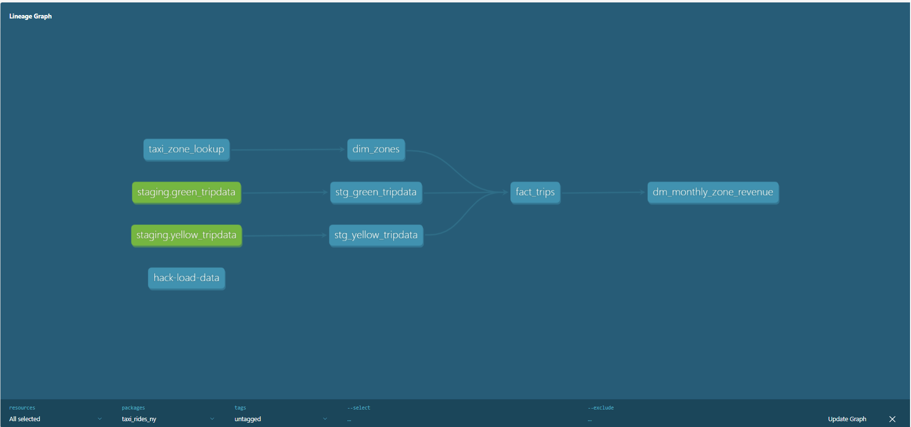
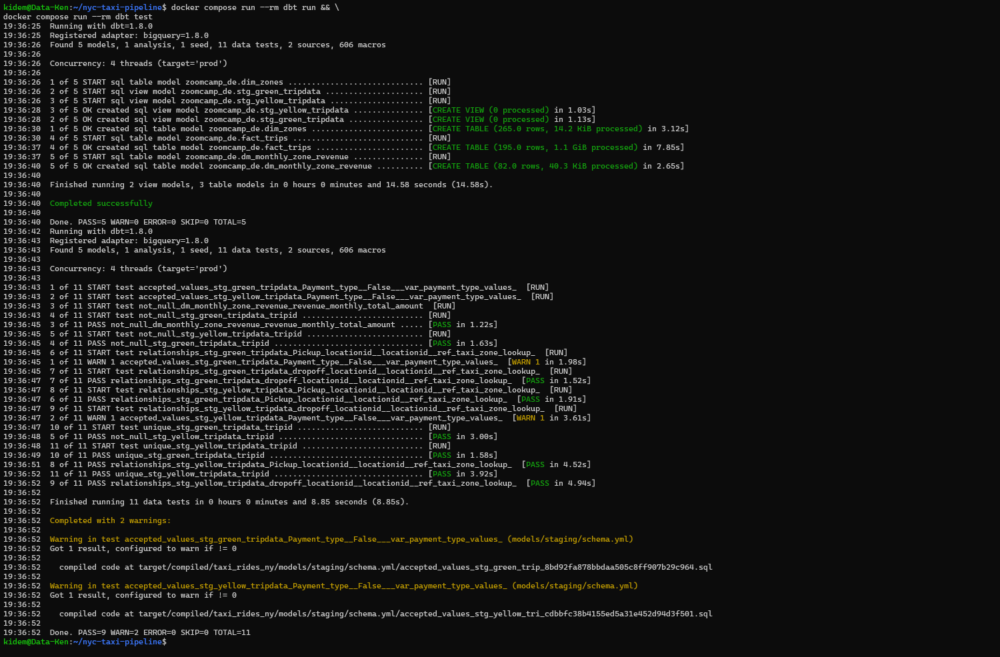
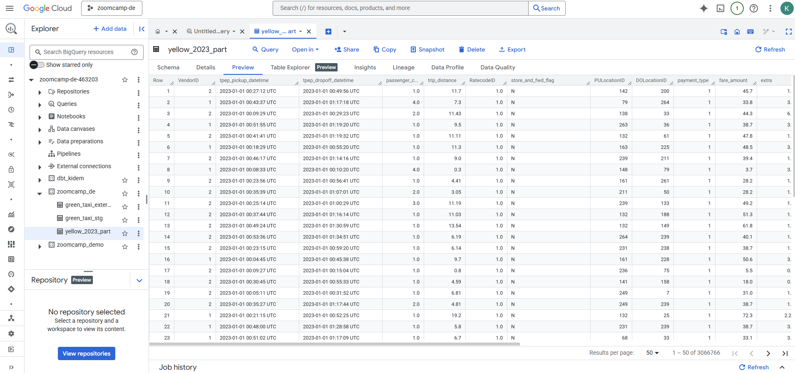
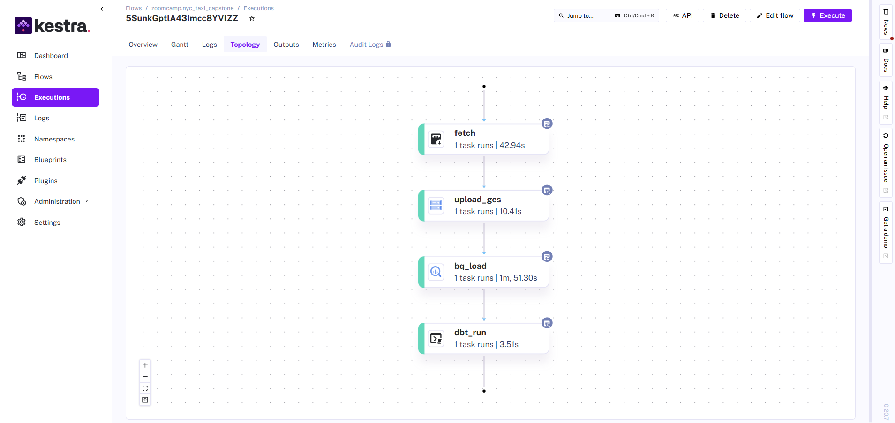
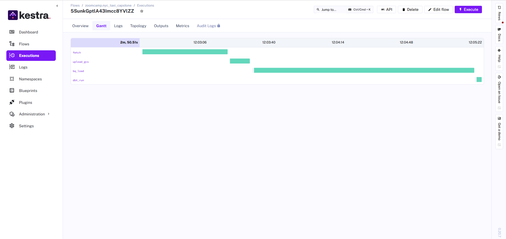

# NYC Taxi ✈ – Mini ELT Warehouse  
GCS ▸ BigQuery ▸ dbt ▸ Kestra


A fully‑containerised pipeline that lands raw Parquet taxi‑trip files in **Google Cloud Storage**, stages them in **BigQuery**, transforms them with **dbt** and lets you browse lineage & docs on **localhost:8088**.  
`docker compose up -d` → done in ≈2 min.

---

## Table of contents
1. [Architecture](#-architecture)
2. [Prerequisites](#-prerequisites)
3. [Folder layout](#-folder-layout)
4. [Quick‑start](#-quick‑start)
5. [Step‑by‑step](#-step‑by‑step)
6. [Troubleshooting](#-troubleshooting)

---

## Architecture


| Layer | Service | How it runs |
|-------|---------|-------------|
| **Orchestrator** | Kestra (`server standalone`) | Docker container – <http://localhost:8080> |
| **Metadata** | Postgres | container, keeps Kestra metadata |
| **Landing zone** | GCS bucket (`dtc-data-lake‑zoomcamp-de‑463203`) | public Parquet data |
| **Warehouse** | BigQuery<br>`trips_data_all` (raw) → `zoomcamp_de` (models) | one SA, two datasets |
| **Transform** | dbt Core 1.8 | CLI container |
| **Docs** | dbt Docs (Flask) | served on **localhost:8088** |

---

## 🛠 Prerequisites
| What | Why | Notes |
|------|-----|-------|
| **Docker** & **Docker Compose v2** | run everything | `docker --version` |
| **gcloud SDK** | optional, create BQ dataset | `gcloud components install` |
| `gcp_key.json` | SA key with **BigQuery Editor** + **Storage Object Viewer** | put in repo root |

> **Service‑account roles**  
> *Project `zoomcamp‑de‑463203`*: `roles/bigquery.dataEditor` & `roles/storage.objectViewer`  
> *Project `taxi‑rides‑ny‑339813`*: `roles/bigquery.dataViewer`

---

## Folder layout
nyc-taxi-pipeline/
├─ docker-compose.yml # all services
├─ flows/ # Kestra YAML flows
├─ dbt/ # dbt project (taxi_rides_ny)
│ ├─ models/…
│ └─ profiles.yml
├─ images/ # screenshots & architecture
├─ gcp_key.json # ← your SA key here
└─ README.md

### Screenshots & diagrams

| Preview | Purpose |
|---------|---------|
|  | **End‑to‑end architecture** – high‑level flow |
|  | **dbt lineage graph** (localhost:8088) |
|  | **dbt run + test output** – terminal snapshot |
|  | **BigQuery dataset view** – resulting tables |
|  | **Kestra flow DAG** – task dependencies |
|  | **Kestra Gantt chart** – task durations |


---

## Quick‑start

```bash
# 1. clone and cd
git clone https://github.com/k-idem/nyc-taxi-pipeline.git
cd nyc-taxi-pipeline

# 2. add your service‑account key
cp ~/Downloads/my-key.json ./gcp_key.json

# 3. spin everything
docker compose up -d

# 4. open Kestra (optional)
open http://localhost:8080        # or xdg-open / start

# 5. trigger the flow in UI OR run dbt locally
docker compose run --rm dbt deps
docker compose run --rm dbt seed
docker compose run --rm dbt run && \
docker compose run --rm dbt test
docker compose run --rm -p 8088:8080 dbt docs serve

# 6. browse docs & lineage
open http://localhost:8088
