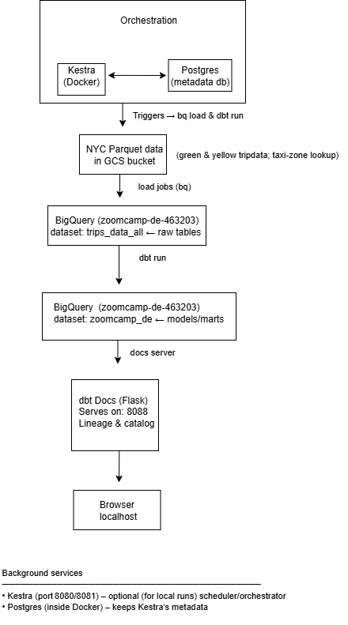

# NYC Taxi ✈ – Mini ELT Warehouse  
**GCS → BigQuery → dbt → Kestra**

A **Docker‑only** showcase that stages raw NYC taxi data in BigQuery, models it with dbt, and orchestrates the whole flow in Kestra—all browsable in your browser.

<p align="center">
  
</p>

---

## Stack at a Glance
| Layer | Component | One‑liner |
|-------|-----------|-----------|
| **Orchestrator** | **Kestra** | YAML flow triggers load ➜ transform tasks |
| **Metadata DB** | **Postgres** | Stores Kestra run history |
| **Landing zone** | **GCS** | Public Parquet files (NYC taxi trips) |
| **Warehouse** | **BigQuery** | `trips_data_all` (raw) ➜ `zoomcamp_de` (models) |
| **Transform** | **dbt Core 1.8** | Build + test models in BigQuery |
| **Docs / Lineage** | **dbt Docs** | Served on **http://localhost:8088** |

---

## Prerequisites
| Tool / File | Why you need it | Quick check |
|-------------|-----------------|-------------|
| **Docker + Compose v2** | run every container | `docker compose version` |
| **gcloud SDK** (once) | create the BQ dataset | `gcloud --version` |
| `gcp_key.json` | SA key with:<br>• `roles/bigquery.dataEditor`<br>• `roles/storage.objectViewer` | drop in repo root |

> **Extra role** – on project **`taxi‑rides‑ny‑339813`** give the same key `roles/bigquery.dataViewer`.

---

### Screenshots & diagrams

* [Architecture](images/architecture.png)
* [dbt lineage graph](images/dbt_lineage.png)
* [dbt run + test output](images/dbt_run.png)
* [BigQuery tables](images/bq_table.png)
* [Kestra flow DAG](images/kestra_DAG_view.png)
* [Kestra Gantt chart](images/kestra_gantt_view.png)

---


## Quick‑start
```bash
# 1. clone & cd
git clone https://github.com/k-idem/nyc-taxi-pipeline.git
cd nyc-taxi-pipeline

# 2. add service‑account key
cp ~/Downloads/my-key.json gcp_key.json

# 3. launch background services (Kestra + Postgres)
docker compose up -d

# 4. trigger the flow in Kestra UI  OR run dbt directly
open http://localhost:8080          # Kestra UI
# – or –
docker compose run --rm dbt deps
docker compose run --rm dbt seed
docker compose run --rm dbt run && \
docker compose run --rm dbt test

# 5. serve docs
docker compose run --rm -p 8088:8080 dbt docs serve

# 6. explore!
open http://localhost:8088          # dbt lineage + catalog


Author
Kenneth Idem
github.com/k-idem


